# PoseBeat MusicGen

## Abstract

PoseBeat MusicGen is a motion to music generation system for AIST++ dance. It learns to convert a five second movement slice into a five second audio clip by conditioning latent diffusion on dense body motion features. Each input slice contains 150 frames at 30 fps, and every frame carries a 370 dimensional conditioning vector. The first 360 channels describe structured pose motion, while the remaining 10 channels provide auxiliary conditioning, so generation is driven by continuous movement rather than text prompts or class labels.

The system converts paired audio into mel spectrogram images, encodes those images with a frozen VAE, and trains a conditional UNet to predict diffusion noise in latent space while attending to the full motion sequence. At inference time, no reference audio is supplied. A saved local Diffusers and AudioDiffusion pipeline receives only the motion tensor, samples the latent denoising trajectory, decodes the mel representation, and returns waveform audio. The final evaluation compares beat alignment, Frechet Audio Distance, paired FAD, and genre distribution divergence on the CDCD subset, showing a clear tradeoff between stronger beat alignment in the high resolution model and stronger distribution metrics in the base model.

## Motion Demo

Click a preview to open the MP4 demo with generated audio.

| Break base | Break high resolution |
| --- | --- |
| [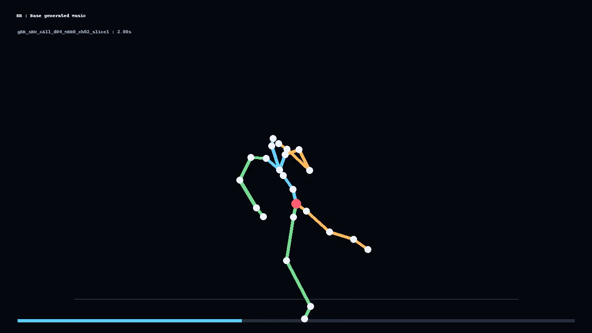](outputs/notebook_examples/human_motion_mp4/gBR_sBM_cAll_d04_mBR0_ch02_slice1_BR_base_human_motion.mp4) | [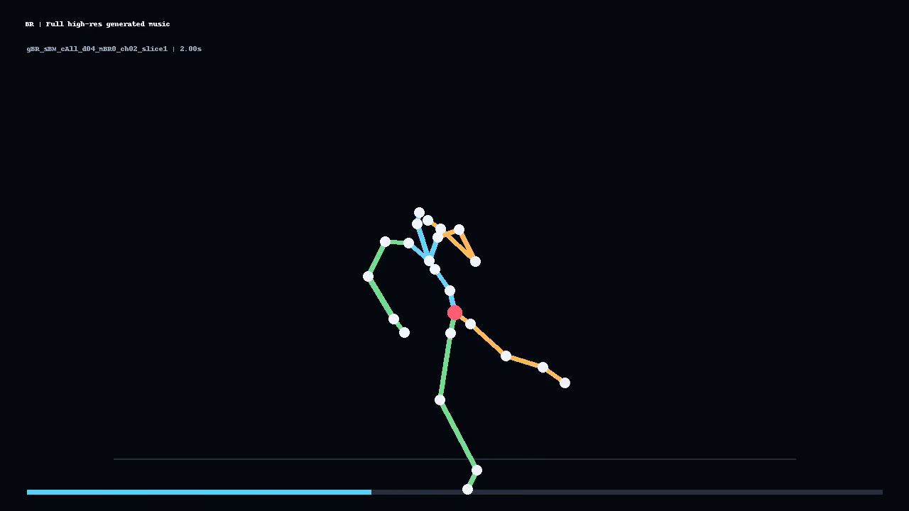](outputs/notebook_examples/human_motion_mp4/gBR_sBM_cAll_d04_mBR0_ch02_slice1_BR_full_hires_human_motion.mp4) |

| Pop base | Pop high resolution |
| --- | --- |
| [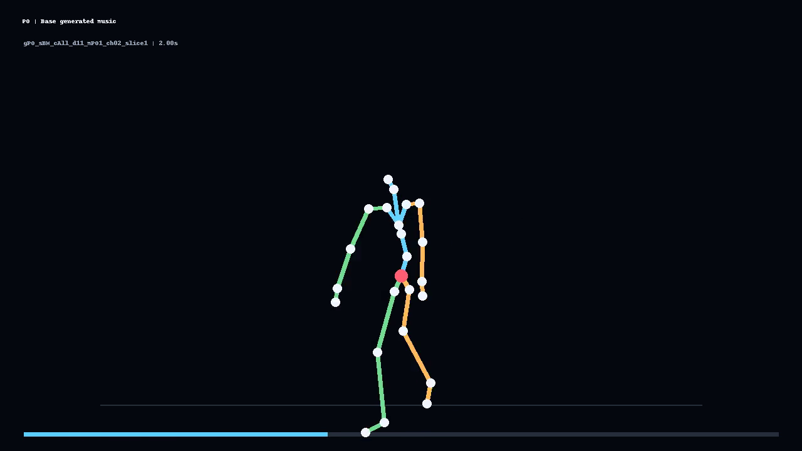](outputs/notebook_examples/human_motion_mp4/gPO_sBM_cAll_d11_mPO1_ch02_slice1_PO_base_human_motion.mp4) | [](outputs/notebook_examples/human_motion_mp4/gPO_sBM_cAll_d11_mPO1_ch02_slice1_PO_full_hires_human_motion.mp4) |

## Method

This section keeps the mathematical model, training objective, inference procedure, and evaluation definitions in one place.

### Problem Definition

For each five second AIST++ slice, let the motion condition be

$$ C = [c_1, c_2, \ldots, c_T] \in \mathbb{R}^{T \times D} $$

$$ T = 150 $$

$$ D = 370 $$

The model learns a conditional distribution over audio:

$$ p_{\theta}(x \mid C) $$

where $x$ is the target waveform or, operationally, the mel spectrogram image derived from that waveform. The project does not feed the reference audio into the generator at inference time. The reference audio is used for training targets, listening comparison, and evaluation.

### Motion Conditioning Tensor

Each frame condition is represented as

$$ c_t = [m_t, a_t] $$

$$ m_t \in \mathbb{R}^{360} $$

$$ a_t \in \mathbb{R}^{10} $$

The first 360 channels can be viewed as 24 joints with 15 values per joint:

$$ M_t = reshape(m_t, 24, 15) \in \mathbb{R}^{24 \times 15} $$

The position part of each joint block is represented by channels 6 through 8:

$$ p_{t,j}^{cond} = M_t[j, 6{:}9] \in \mathbb{R}^{3} $$

Raw AIST++ SMPL motion uses axis angle rotations and root translation. For joint $j$ with parent $pa(j)$, local axis angle rotations are converted to rotation matrices, and forward kinematics recursively computes global joint positions:

$$ R_{t,j}^{local} = Rodrigues(r_{t,j}) $$

$$ P_{t,root} = q_t $$

$$ R_{t,root}^{global} = R_{t,root}^{local} $$

$$ P_{t,j} = P_{t,pa(j)} + R_{t,pa(j)}^{global} o_j $$

$$ R_{t,j}^{global} = R_{t,pa(j)}^{global} R_{t,j}^{local} $$

Here $o_j$ is the SMPL joint offset. The same equations describe how raw SMPL pose can be converted into global 3D joint positions, while normalized condition space positions can be read directly from $M_t[j, 6{:}9]$.

### Audio Representation

Training does not directly denoise waveform samples. A waveform slice is converted to a mel spectrogram image:

$$ x \mapsto I \in [-1, 1]^{C_{img} \times H \times W} $$

The base model uses $H = W = 256$; the high resolution model uses $H = W = 512$. A frozen VAE encoder maps the mel image into latent space:

$$ z_0 = s \, E_{\phi}(I) $$

where $E_{\phi}$ is the VAE encoder and $s$ is the VAE scaling factor. In the code this is handled by `encode_images_to_latents()` in `utils/audio_latents.py`.

The VAE remains frozen:

$$ \nabla_{\phi} \mathcal{L} = 0 $$

Only the conditional denoising UNet is optimized.

### Conditional UNet

The trainable denoiser is

$$ \epsilon_{\theta}(z_t, t, C) $$

where $z_t$ is the noisy latent at diffusion timestep $t$, and $C$ is the full motion conditioning sequence. The implementation passes $C$ to Diffusers as `encoder_hidden_states`, so the UNet cross attention blocks can attend over the 150 motion frames:

$$ Q_t = W_Q h(z_t) $$

$$ K_C = W_K C $$

$$ V_C = W_V C $$

$$ A_t = softmax((Q_t K_C^T) / \sqrt{d_k}) V_C $$

The base conditional UNet uses four down and up blocks with cross attention in the first three down blocks and last three up blocks. The high resolution `wide_64` variant uses five blocks and adds another cross attention level for the 512x512 mel setting.

The core call during training is:

```text
noise_pred = unet(noisy_latents, timesteps, encoder_hidden_states=conditioning).sample
```

### Forward Diffusion

During training, clean latents are noised according to a scheduler with cumulative noise coefficient $\bar{\alpha}_t$:

$$ z_t = \sqrt{\bar{\alpha}_t} z_0 + \sqrt{1 - \bar{\alpha}_t} \epsilon $$

$$ \epsilon \sim \mathcal{N}(0, I) $$

The timestep $t$ is sampled uniformly from the training diffusion horizon:

$$ t \sim U\{0, \ldots, N - 1\} $$

The saved configs use $N = 1000$ training timesteps.

### Training Objective

The UNet is trained to predict the exact noise added to the clean latent:

$$ \hat{\epsilon}_t = \epsilon_{\theta}(z_t, t, C) $$

The optimization objective is mean squared error:

$$ \mathcal{L}_{simple}(\theta) = \mathbb{E}_{z_0, C, t, \epsilon}[\lVert \epsilon - \epsilon_{\theta}(z_t, t, C) \rVert_2^2] $$

$$ \theta^* = \arg\min_{\theta} \mathcal{L}_{simple}(\theta) $$

In code:

```text
loss = F.mse_loss(noise_pred.float(), noise.float())
```

The optimizer is AdamW with cosine learning rate scheduling, warmup, gradient clipping, distributed data parallel support, and optional exponential moving average weights for saved pipelines.

### Inference

At inference time, the model starts from Gaussian latent noise:

$$ z_N \sim \mathcal{N}(0, I) $$

For each reverse diffusion step, the scheduler uses the denoiser prediction and the motion condition:

$$ \hat{\epsilon}_t = \epsilon_{\theta}(z_t, t, C) $$

The scheduler then computes the previous latent:

$$ z_{t - 1} = f_{sched}(z_t, \hat{\epsilon}_t, t) $$

After the final reverse step, the VAE decoder maps the latent mel image back through the AudioDiffusion pipeline:

$$ \hat{I} = D_{\phi}(z_0 / s) $$

$$ \hat{x} = Mel^{-1}(\hat{I}) $$

The generated WAV is then clipped to `[-1, 1]` before writing:

$$ \tilde{x} = clip(\hat{x}, -1, 1) $$

The saved inference seed is `2391504374279719` and the saved `eta` value is `0.0`.

### Loudness Normalization

Generated WAVs are normalized before evaluation. The soundfile path estimates RMS loudness:

$$ rms(x) = \sqrt{\frac{1}{n}\sum_{i = 1}^{n} x_i^2} $$

$$ dBFS(x) = 20 \log_{10}(rms(x)) $$

The gain is chosen to match the target loudness and then add the configured gain offset:

$$ g = 10^{(targetDBFS - dBFS(x) + gainDB) / 20} $$

$$ x_{norm} = clip(gx, -1, 1) $$

### Evaluation Metrics

Evaluation uses the 31 file CDCD subset in `configs/cdcd_aist.txt`. The saved final comparison uses 31/31 available generated reference pairs.

Beat coverage and beat hit use one onset bin per second. Let $b_i$ be the reference beat indicator for second $i$, and let $\hat{b}_i$ be the generated beat indicator:

$$ coverage = \frac{\sum_i \hat{b}_i}{\sum_i b_i} $$

$$ hit = \frac{\sum_i 1[b_i = 1 \land \hat{b}_i = 1]}{\sum_i b_i} $$

Frechet Audio Distance compares embedding distributions from reference and generated audio. If embeddings are approximated as Gaussians $(\mu_r, \Sigma_r)$ and $(\mu_g, \Sigma_g)$, the FAD form is:

$$ FAD = \lVert \mu_r - \mu_g \rVert_2^2 + Tr(\Sigma_r + \Sigma_g - 2(\Sigma_r \Sigma_g)^{1/2}) $$

DMD style FAD uses all 186 reference test WAVs against the 31 generated CDCD WAVs. Paired CDCD FAD uses only the same 31 reference and generated pairs.

Genre KLD uses MS SincResNet predictions. If $p$ is the reference genre distribution and $q$ is the generated genre distribution:

$$ D_{KL}(p \parallel q) = \sum_{k = 1}^{K} p_k \log \frac{p_k}{q_k} $$

Lower FAD and lower genre KLD are better. Higher beat coverage and beat hit are better.

## Output Gallery

### Dataset Overview

These panels show how AIST++ dances become five second examples, how the train, test, and CDCD splits are distributed, how the mel datasets are materialized, and what one normalized motion condition tensor looks like.

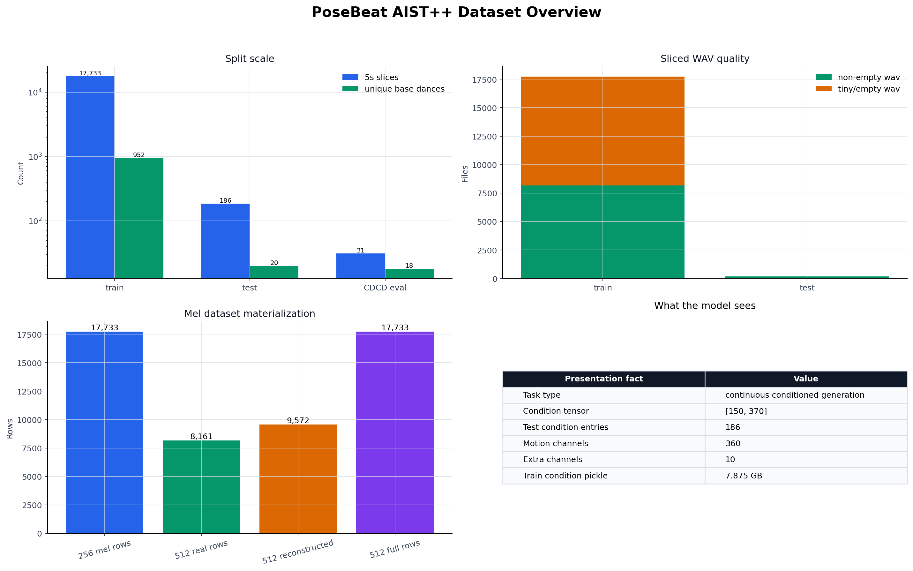

The dashboard summarizes split scale, sliced WAV quality, mel dataset materialization, and the `[150, 370]` condition tensor used by the model.

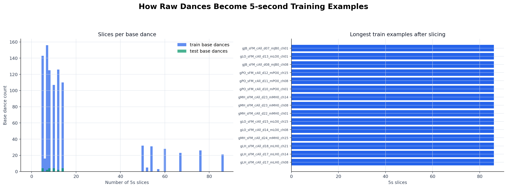

The slice distribution panel shows how raw base dances expand into five second training and test examples, including the longest train sequences after slicing.

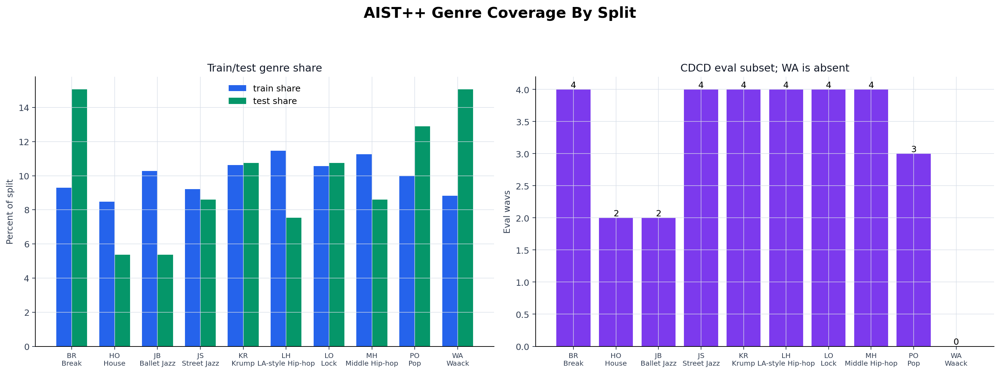

The genre distribution panel shows train and test genre shares across the ten AIST++ genre codes and shows that `WA` is absent from the CDCD evaluation subset.

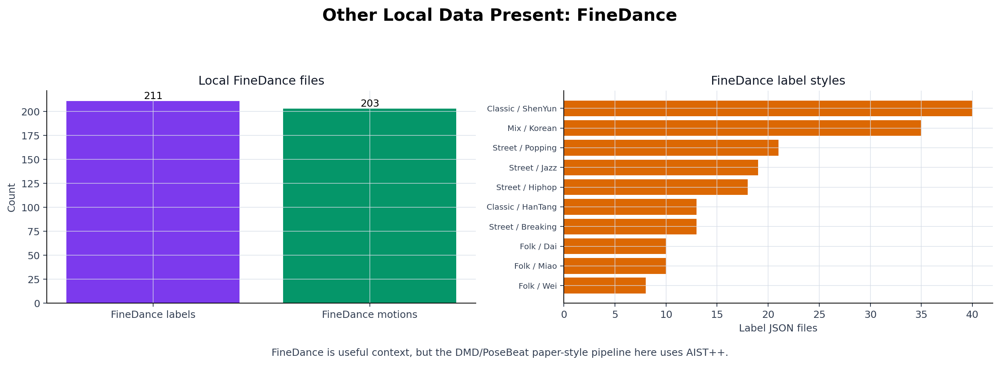

The FineDance context panel records the other local motion data present in the workspace while keeping this project focused on the AIST++ based PoseBeat pipeline.

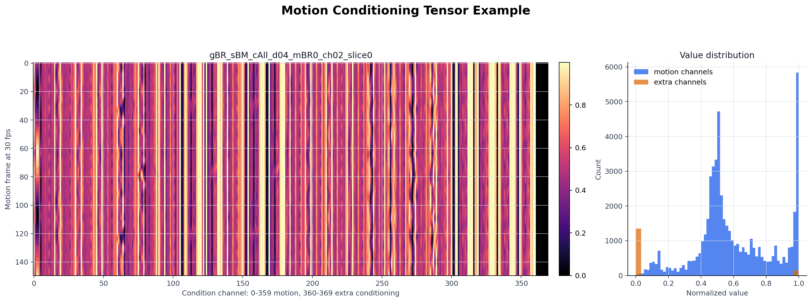

The condition tensor panel shows one normalized motion sequence over 150 frames. Channels 0 through 359 carry motion features, and channels 360 through 369 carry the extra conditioning values.

### Training Curves

These panels show the loss behavior for the base 256x256 model and the high resolution 512x512 model.

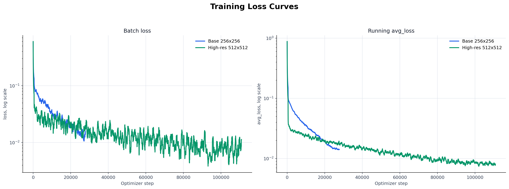

The loss curve panel compares batch loss and running average loss across optimizer steps. Both models descend steadily, while the high resolution run continues for more steps.

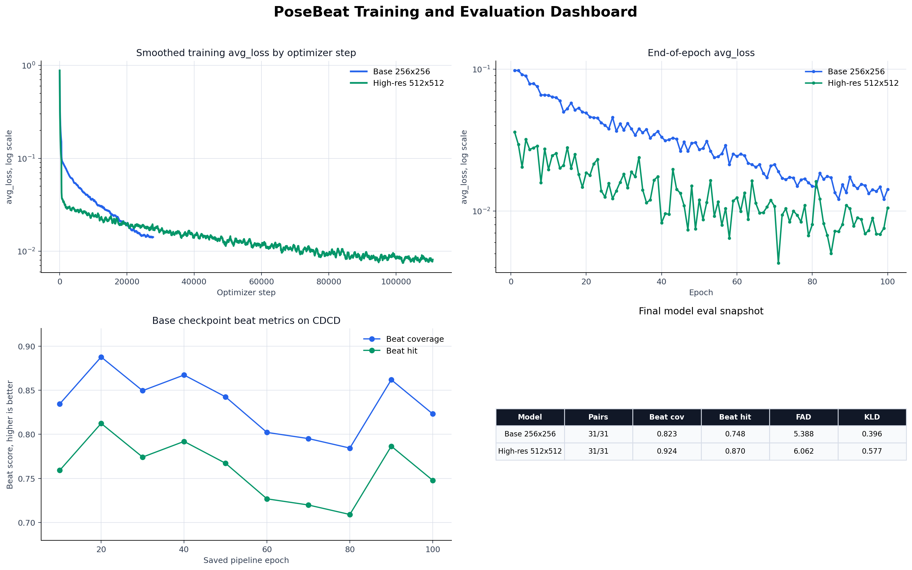

The training dashboard combines smoothed loss, end of epoch loss, base checkpoint beat metrics, and the final evaluation snapshot in one panel.

### Evaluation Curves

These panels show the saved evaluation behavior across checkpoints and the final base versus high resolution comparison.

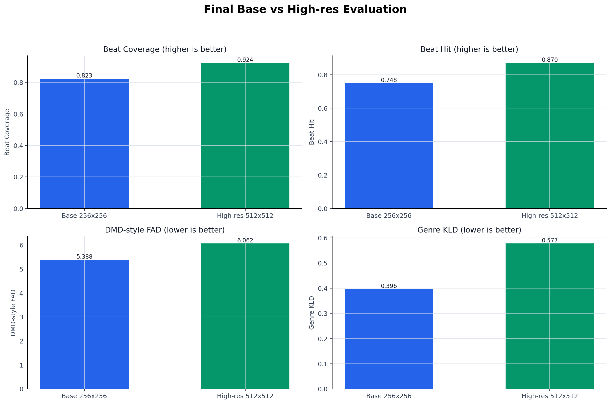

The final comparison shows the high resolution model ahead on beat coverage and beat hit, while the base model keeps lower DMD style FAD and lower genre KLD.

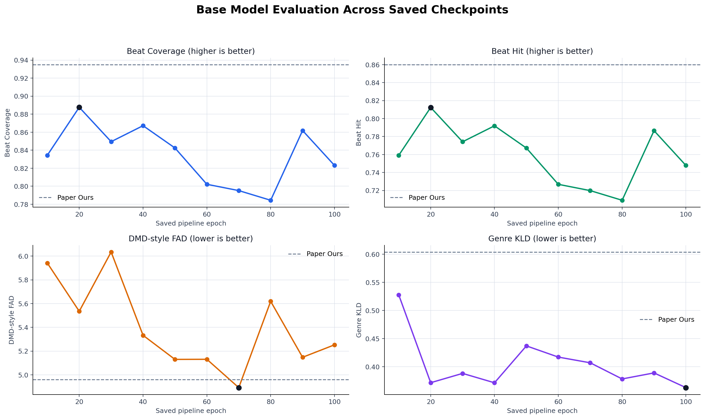

The base checkpoint progression shows that epoch 20 is strongest for beat metrics, epoch 70 is strongest for DMD style FAD, and epoch 100 is strongest for genre KLD.

## Setup

From the project root:

```bash
cd /mntdatalora/src/PoseBeat-MusicGen
pip install -r requirements.txt
```

Core dependencies:

- `torch`
- `torchvision`
- `torchaudio`
- `diffusers==0.18.1`
- `accelerate==0.20.3`
- `audiodiffusion`
- `datasets==2.13.1`
- `huggingface_hub==0.16.4`
- `numpy`
- `pandas`
- `scipy`
- `librosa`
- `soundfile`
- `Pillow`
- `PyYAML`
- `tensorboard`
- `frechet_audio_distance`

Optional but useful:

- CUDA enabled PyTorch for training and sampling on GPU
- `ffmpeg` or `avconv` for pydub fallback paths, although the current normalization script can write normalized WAVs through `soundfile`

## References

- `works/dmd/`: local DMD style baseline and evaluation reference code
- `configs/cdcd_aist.txt`: CDCD evaluation subset used by the saved metrics
- `notebooks/posebeat_continuous_conditioned_task4.ipynb`: submission workbook with artifact links, five example inference code, and listening examples

## Dataset And Model Summary

The project uses AIST++ dance/music pairs processed into five second examples. Motion is stored as normalized conditioning tensors, while audio is converted to mel spectrogram images for latent diffusion training. The base pipeline uses 256x256 mel images. The high resolution pipeline uses 512x512 mel images with a shorter hop length.

The high resolution preprocessing first renders real high resolution mel rows from non empty sliced WAV files. It then rebuilds a full high resolution dataset by reusing real rows and reconstructing missing rows from the 256x256 reference dataset. This matters because many training WAV slices are tiny or empty.

| Item | Value |
| --- | ---: |
| Raw AIST++ official `all.txt` entries | 1408 |
| Local raw motion `.pkl` files present | 411 |
| Crossmodal train base dances | 980 |
| Crossmodal validation base dances | 20 |
| Crossmodal test base dances | 20 |
| Train sliced WAV files | 17733 |
| Train unique base dances | 952 |
| Test sliced WAV files | 186 |
| Test unique base dances | 20 |
| CDCD evaluation WAV files | 31 |
| CDCD unique base dances | 18 |

| Split | Non empty WAVs | Tiny/empty WAVs |
| --- | ---: | ---: |
| Train | 8161 | 9572 |
| Test | 186 | 0 |

| Representation | Value |
| --- | --- |
| Test condition entries | 186 |
| Condition tensor shape | `[150, 370]` |
| Motion channels | 360 |
| Extra condition channels | 10 |
| Train condition pickle size | 7.875 GB |

| Mel dataset | Rows |
| --- | ---: |
| 256x256 base mel dataset | 17733 |
| 512x512 real rendered rows | 8161 |
| 512x512 full rows | 17733 |
| 512x512 reused real rows | 8161 |
| 512x512 reconstructed rows | 9572 |

## Genre Coverage

| Genre | Train | Test | CDCD eval |
| --- | ---: | ---: | ---: |
| BR | 1647 | 28 | 4 |
| HO | 1505 | 10 | 2 |
| JB | 1824 | 10 | 2 |
| JS | 1635 | 16 | 4 |
| KR | 1884 | 20 | 4 |
| LH | 2033 | 14 | 4 |
| LO | 1872 | 20 | 4 |
| MH | 1996 | 16 | 4 |
| PO | 1772 | 24 | 3 |
| WA | 1565 | 28 | 0 |

The train and test splits cover all ten AIST++ genre codes. The CDCD evaluation subset covers nine of ten genre codes; `WA` is absent, so CDCD is useful for the saved beat/FAD/KLD comparison but is not fully genre balanced.

## Training Results

| Model | Completed epochs | Final step | Training hours | Final avg loss | Best avg loss | Best avg loss epoch |
| --- | ---: | ---: | ---: | ---: | ---: | ---: |
| Base 256x256 | 100 | 27800 | 6.118 | 0.014212 | 0.011292 | 99 |
| High res 512x512 | 100 | 110900 | 39.495 | 0.010552 | 0.004128 | 86 |

The high resolution training log contains four rows from an aborted warmup run. The generated training curve summary discards those restart rows and uses the completed run.

## Evaluation Results

Evaluation is based on the 31 file CDCD subset listed in `configs/cdcd_aist.txt`. BAS is not included in the saved comparison because the existing run notes report a `librosa`/`numba` crash for that metric in this Python 3.12 environment.

| Model | Eval pairs | Beat coverage | Beat hit | DMD style FAD | Paired CDCD FAD | Genre KLD |
| --- | ---: | ---: | ---: | ---: | ---: | ---: |
| Base final | 31/31 | 0.823118 | 0.747849 | **5.388294** | **5.569767** | **0.395714** |
| High res final | 31/31 | **0.923656** | **0.869892** | 6.061841 | 6.601581 | 0.577380 |

Base checkpoint progression:

| Metric | Best saved epoch | Value |
| --- | ---: | ---: |
| Beat coverage | 20 | 0.887634 |
| Beat hit | 20 | 0.812366 |
| DMD style FAD | 70 | 4.892014 |
| Genre KLD | 100 | 0.362891 |

No single base checkpoint wins every metric. Epoch 20 is strongest for beat matching, epoch 70 is strongest for DMD style FAD, and epoch 100 is strongest for genre KLD.

## Code Organization

```text
configs/             YAML configs for base and high resolution runs
evaluation/          Beat, FAD, genre KLD, loudness normalization, and combined evaluation scripts
execution_scripts/   Bash launchers for dataset building and training
logs/                Training, preprocessing, sampling, normalization, and evaluation logs
models/              Backward compatible re exports
modules/             Canonical model and pipeline modules
notebooks/           Submission notebook
outputs/             Saved pipelines, generated WAVs, metrics, and reports
scripts/             Dataset rendering, training, sampling, and inspection scripts
utils/               Config, dataset, checkpoint, logging, and latent helpers
works/               Local reference/baseline code used for context
```

## License

This project is released under the MIT License.

Copyright (c) 2026 Varun Moparthi

See [LICENSE](LICENSE) for the full license text.
